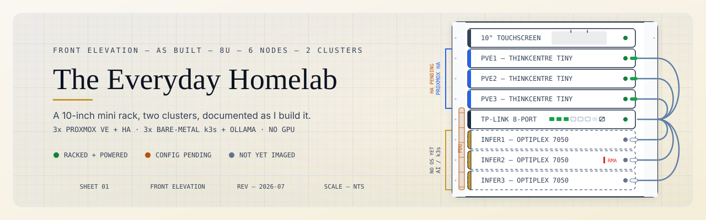
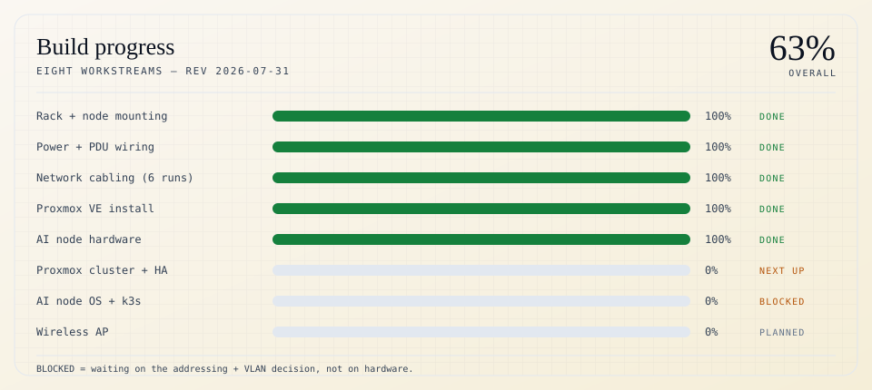
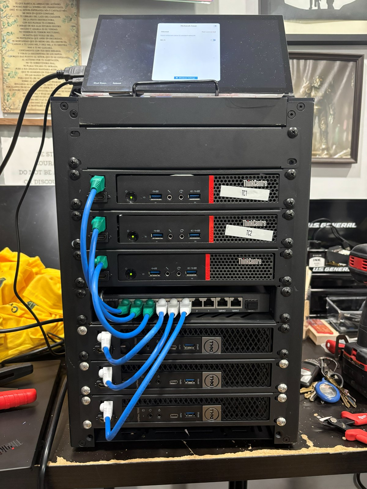
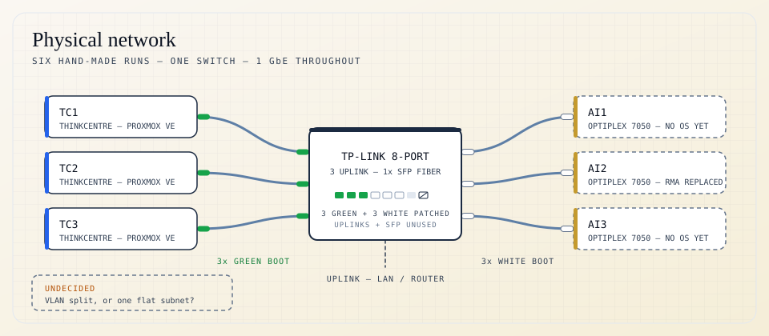
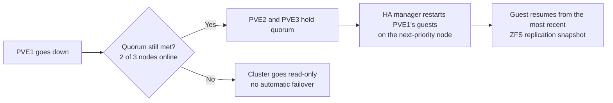
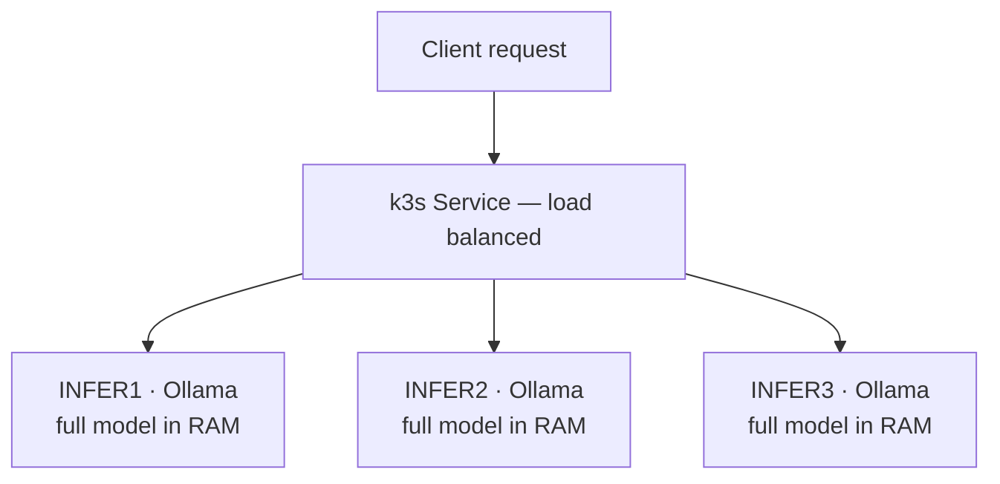
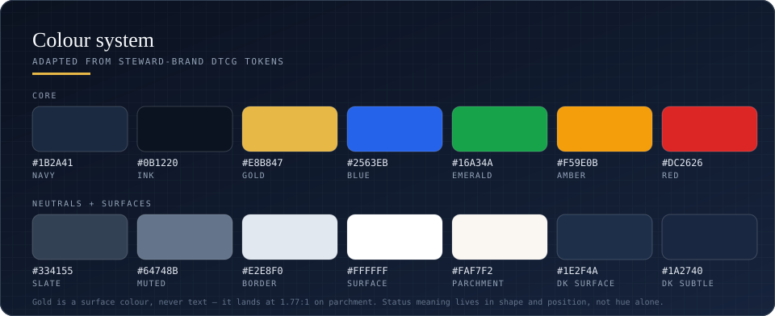

<picture>
  <source media="(prefers-color-scheme: dark)" srcset="images/hero-dark.svg">
  
</picture>

<a href="#decisions"><b>Decisions</b></a> &nbsp;·&nbsp;
<a href="#status"><b>Status</b></a> &nbsp;·&nbsp;
<a href="#rack"><b>The rack</b></a> &nbsp;·&nbsp;
<a href="#network"><b>Network</b></a> &nbsp;·&nbsp;
<a href="#proxmox"><b>Proxmox</b></a> &nbsp;·&nbsp;
<a href="#ai"><b>AI cluster</b></a> &nbsp;·&nbsp;
<a href="#open"><b>Open questions</b></a> &nbsp;·&nbsp;
<a href="docs/gear.md"><b>Gear</b></a> &nbsp;·&nbsp;
<a href="docs/software.md"><b>Software</b></a>

---

Six used mini PCs in a 10-inch rack, split into two clusters: three Lenovo ThinkCentre Tinys running Proxmox VE with HA, and three Dell OptiPlex 7050 Micros running k3s and Ollama with no GPU between them. This repo is the build log **and the reasoning** — what I chose, what I rejected, and why — written as I go rather than cleaned up afterward.

 

##  Two decisions this build is built around

Most homelab writeups show you a finished rack and a parts list. The part I always wanted and could never find was the reasoning. These two calls shaped everything else:

<table>
<tr>
<td width="50%" valign="top">

**HA without shared storage**

Three ThinkCentres, no SAN and no NAS — so instead of shared storage, the cluster runs **ZFS + Proxmox Storage Replication** on periodic snapshots. All three nodes stay live members: PVE1 and PVE2 are a high-priority pair, PVE3 sits at lower HA priority running backup and monitoring but still picks up VMs automatically.

[Read the reasoning →](docs/proxmox-ha.md)

</td>
<td width="50%" valign="top">

**Three replicas, not one split model**

Running one large model split across three nodes over 1GbE with no GPUs makes the network the per-token bottleneck. So each node independently serves a **full small model** behind a load-balanced k3s Service. Less impressive on paper, meaningfully more throughput in practice.

[Read the reasoning →](docs/ai-cluster.md)

</td>
</tr>
</table>

> [!NOTE]
> This is not a copy-paste tutorial. It's a record of decisions you'll have to make too, with my reasoning attached so you can disagree with it.

 

##  Where this is right now

The rack is built and wired, and I'm partway through configuration. Everything below is either done, blocked on a decision I haven't made, or waiting its turn — **nothing here is aspirational**.

<picture>
  <source media="(prefers-color-scheme: dark)" srcset="images/chart-progress-dark.svg">
  
</picture>

|  | Workstream | State |
|:--:|:--|:--|
|  | Rack assembled, all 6 nodes mounted | Standing on a bench, top to bottom: touchscreen, PVE1–PVE3, switch, 3× OptiPlex |
|  | Power wiring confirmed | 6× Anker 65W USB-C PD, one per node, all on the rack PDU |
|  | All 6 Ethernet runs made and connected | Hand-terminated: green boots to the ThinkCentres, white to the OptiPlexes |
|  | Proxmox VE installed on PVE1 / PVE2 / PVE3 | Installed and booting. Not yet clustered |
|  | AI node hardware validated | Middle OptiPlex failed on first power-up and was replaced; all three are good |
|  | Proxmox cluster + HA groups + ZFS replication | Next up — nothing blocking it but time |
|  | AI nodes: Ubuntu 24.04 imaging, then k3s | **Deliberately blocked** — see below |
|  | Wireless AP in bridge/AP mode | Hardware not bought; may not belong in the rack at all |

**On the AI nodes having no OS yet.** All three are racked, powered and cabled. I haven't imaged them on purpose: k3s node identity depends on addressing, and I haven't settled static IPs vs DHCP reservations, or whether the two clusters get separate VLANs. Imaging before that decision means re-imaging after it.

 

##  The rack

<table>
<tr>
<td width="40%" valign="top">

 
<b>As built.</b> The elevation at the top of this page is this rack, unit for unit. Every run is the same blue cable — boot colour is the entire labelling scheme, green into the ThinkCentres and white into the OptiPlexes. The touchscreen is mid-complaint about an unplugged NIC, which is roughly the permanent state of things.
</td>
<td valign="top">
<ul>
<li> <b>Proxmox cluster</b> — 3× Lenovo ThinkCentre Tiny (<code>PVE1</code>, <code>PVE2</code>, <code>PVE3</code>), Proxmox VE installed, being configured for HA</li>
 
<li> <b>AI testing cluster</b> — 3× Dell OptiPlex 7050 Micro, Kaby Lake i5/i7, integrated graphics only, bare-metal Ubuntu + k3s + Ollama</li>
 
<li> <b>Networking</b> — TP-Link 8-port switch, 1 fiber SFP port unused, all 6 nodes wired at 1GbE</li>
 
<li> <b>Power</b> — every node on the same Anker 65W GaN charger via a USB-C-to-tip cable, into an 8-outlet 1U PDU</li>
 
<li> <b>Enclosure</b> — GeeekPi 8U 10-inch cabinet (DeskPi RackMate T1 Plus), one 1U shelf per node with front RJ45 + HDMI pass-through</li>
 
<li> <b>Console</b> — HMTECH 10.1" IPS touchscreen hinged on top, used to check each node's boot output. Not a permanent console</li>
</ul>
</td>
</tr>
</table>

###  One power standard for six nodes

Neither machine takes USB-C power natively, and they disagree about the shape of the plug — the ThinkCentres want Lenovo's square slim tip, the OptiPlexes want a 4.5 × 3.0 mm barrel. The obvious path is six OEM bricks in two shapes. Instead every node runs the same **Anker Nano 65W GaN charger** with a short USB-C-to-tip cable doing the translation:

| Nodes | Tip needed | Cable |
|---|---|---|
| ThinkCentre Tiny × 3 | Lenovo slim tip (square) | [USB-C → slim tip, 100W PD](https://www.amazon.com/dp/B0947RD4H2) |
| OptiPlex 7050 Micro × 3 | 4.5 × 3.0 mm barrel | [USB-C → 4.5 × 3.0 mm, 100W PD](https://www.amazon.com/dp/B0975DWM1R) |

Six identical chargers means one spare covers any node in the rack, the bricks stack instead of fighting for outlet space, and replacing a dead PSU is a $20 part rather than a hunt for a discontinued OEM adapter. Full part links, plus the enclosure and console, are in [`docs/gear.md`](docs/gear.md).

> [!NOTE]
> 65W matches the OEM rating for both machines rather than exceeding it, so there's no headroom for a higher-draw configuration. Total draw is roughly 390W flat out against the PDU's 1875W, so the rail is nowhere near the limit — the per-node budget is the thing to watch, not the total.

<b>Full hardware inventory</b>

 

| Component | Qty | Model | Notes |
|---|:--:|---|---|
| Enclosure | 1 | GeeekPi 8U 10-inch cabinet (DeskPi RackMate T1 Plus) | 260 mm depth — see [gear](docs/gear.md#enclosure) for the link |
| Node shelves | 6 | GeeekPi 10-inch 1U mini-PC shelf | Front RJ45 CAT6 + HDMI pass-through — why the cabling presents at the front |
| Compute nodes | 3 | Lenovo ThinkCentre Tiny — `PVE1`, `PVE2`, `PVE3` | Proxmox VE hypervisor nodes |
| AI cluster nodes | 3 | Dell OptiPlex 7050 Micro — `INFER1`, `INFER2`, `INFER3` | Kaby Lake i5/i7, integrated graphics only |
| Switch | 1 | TP-Link 8-port (uplink ports, 1× SFP fiber) | Core switch, SFP unused |
| Power | 6 chargers + 2 cable types + 1 PDU | Anker Nano 65W GaN, two tip cables, ElecVoztile PDU | See [gear](docs/gear.md#power) for links and part numbers |
| Display | 1 | HMTECH 10.1" IPS touchscreen | 1024 × 600, HDMI, driver-free — see [gear](docs/gear.md#console) |
| Wireless | 1 | Wireless router *(planned)* | AP mode, not yet installed |

Purchase links for every linkable part live in [`docs/gear.md`](docs/gear.md) so they only need updating in one place.

 

##  Physical network

Six hand-made runs into one switch, all of them the same blue cable. There are no port labels and no cable tags — the boot colour is the entire scheme, and it has held up fine at this size. Green is Proxmox, white is AI.

<picture>
  <source media="(prefers-color-scheme: dark)" srcset="images/topology-dark.svg">
  
</picture>

 

##  Proxmox cluster — HA without shared storage

Three nodes means quorum is a majority of 2, so no external QDevice or tie-breaker is needed — that's only required for 2-node clusters. Rather than burning a third of total compute on a cold spare, all three stay live with different roles.

| Node | HA priority | Day-to-day role | On failure of a primary |
|---|:--:|---|---|
| `PVE1` | High | Primary compute | — |
| `PVE2` | High | Primary compute | — |
| `PVE3` | Low | Backup + monitoring services | Automatically picks up the failed node's guests |

What actually happens when a primary drops:

**The tradeoff, stated plainly:** ZFS replication is asynchronous. Failover costs you everything written since the last sync — if replication runs every 5 minutes, that's your worst-case data loss window. Shared storage wouldn't have that gap. A NAS with an NFS or iSCSI target would be the cleaner answer if one ever gets added.

Planned services, as LXC containers rather than full VMs — the ThinkCentre Tiny's RAM is tight and per-service overhead matters more than isolation here:

<table>
<tr><td width="34"></td><td><b>Uptime Kuma</b> — self-hosted uptime and status monitoring</td></tr>
<tr><td></td><td><b>Portainer</b> — Docker and container management UI</td></tr>
</table>

[Full Proxmox plan →](docs/proxmox-ha.md)

 

##  AI cluster — three replicas, not one split model

Kaby Lake i5/i7, integrated graphics only, modest RAM. This is CPU-only inference on small quantized models — genuinely useful for learning distributed serving, not for fast large-model inference. Being honest about that up front is the whole point.

The interesting decision is the serving pattern:

| | Replicated Service *(chosen)* | One model RPC-split across 3 nodes |
|---|---|---|
| Concurrent requests | 3 in parallel | 1 at a time |
| Network per token | None — inference is node-local | Layer activations cross 1GbE every token |
| Max model size | Bounded by one node's RAM | Sum of all three nodes' RAM |
| Failure of one node | Service drops to 2 replicas | Whole pipeline stalls |
| Mirrors production? | Yes | Rarely |

With 1GbE and no GPUs, splitting a model's layers across nodes technically works but makes the interconnect the bottleneck on every single token. Independent replicas get more real throughput and match how production inference clusters are actually built.

**Starting models** — `Llama 3.2 3B` · `Phi-3.5-mini` · `Qwen2.5 7B (Q4)`

**Stretch goal, explicitly filed under "fun, not practical":** once the basics work, splitting a larger model across all three via the llama.cpp RPC backend or `exo`. Expect it to be slow. That's the lesson.

[Full AI cluster plan →](docs/ai-cluster.md)

 

##  Open questions

Genuinely unresolved. I'd take input on any of these — open an issue or a discussion.

1. **VLAN split between the Proxmox and AI clusters, or one flat subnet?** The AI cluster is the only thing I'd ever consider exposing beyond the LAN, which argues for separation — but it's six nodes and one switch.
2. **Static IPs or DHCP reservations for the six nodes?** Proxmox cluster membership and k3s node identity both care, and this is what's currently blocking OS imaging.
3. **Where does the wireless AP go?** The router isn't installed and I'm not convinced it belongs in the rack at all.

 

##  Docs

| Document | What's in it |
|---|---|
| [`docs/build-log.md`](docs/build-log.md) | Step-by-step build log — assembly, mounting order, cabling, what broke |
| [`docs/proxmox-ha.md`](docs/proxmox-ha.md) | Cluster formation, HA group design, ZFS replication, planned services |
| [`docs/ai-cluster.md`](docs/ai-cluster.md) | OS choice, k3s layout, serving pattern reasoning, model selection |
| [`docs/gear.md`](docs/gear.md) | Every part with a link — enclosure, shelves, power, console |
| [`docs/software.md`](docs/software.md) | Everything running or planned, by layer, with status |

Build photos go in [`images/`](images/) as they're taken.

<b>Colour system</b> — the palette these diagrams are drawn in

 

Adapted from [steward-brand](https://github.com/24Skater/steward-brand)'s DTCG tokens. Every diagram in this repo ships as a light and a dark SVG, swapped with `<picture>`; the icons are single files coloured to clear 4:1 on both GitHub themes, so they never depend on theme detection.

Status meaning is carried by shape and position as well as hue — solid outline is built, dashed is not yet imaged — so the diagrams stay readable without colour vision.

 

---

A build log, not a tutorial. Written as it happens, mistakes included.

