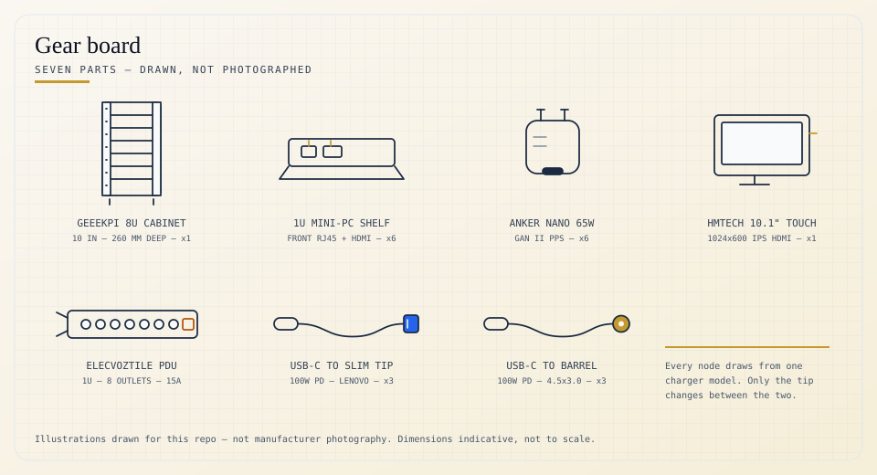

# Gear

The parts that make up the rack, with links. No affiliate tags — these are plain product URLs.

<picture>
  <source media="(prefers-color-scheme: dark)" srcset="../images/gear-dark.svg">
  
</picture>

 

## Enclosure

| Part | Qty | Notes |
|---|:--:|---|
| [GeeekPi 8U 10-inch cabinet](https://www.amazon.com/dp/B0FWJXF7FM) — DeskPi RackMate T1 Plus | 1 | 260 mm depth. This is where the "8U" in the front-elevation diagram comes from |
| [GeeekPi 10-inch 1U mini-PC shelf](https://www.amazon.com/dp/B0FN44R7F2) | 6 | Front RJ45 CAT6 + HDMI pass-through per shelf — see below |

One shelf per node. The pass-through is the reason every cable in the [build photo](../README.md#rack) reaches from the front of the rack rather than around the back: each shelf brings the node's rear ports forward to its own front face, so patching the switch or checking a display doesn't mean pulling the whole unit out.

## Power

| Part | Qty | Notes |
|---|:--:|---|
| [Anker Nano 65W GaN II PPS](https://www.amazon.com/dp/B08T5QN2TR) | 6 | One per node, all the same model |
| [USB-C → Lenovo slim tip, 100W PD](https://www.amazon.com/dp/B0947RD4H2) | 3 | ThinkCentre Tiny (`TC1`–`TC3`) |
| [USB-C → 4.5 × 3.0 mm barrel, 100W PD](https://www.amazon.com/dp/B0975DWM1R) | 3 | OptiPlex 7050 Micro (`AI1`–`AI3`) |
| [ElecVoztile 10-inch 1U PDU](https://www.amazon.com/dp/B0FRMQJGJB) | 1 | 8 rear outlets, 15A, 1020J surge, 6 ft cable |

Neither the ThinkCentre nor the OptiPlex takes USB-C power natively, and the two disagree on plug shape. Rather than sourcing OEM bricks in two different shapes, every node runs the identical Anker charger, and a $10 cable does the plug translation. One spare charger covers any node in the rack; a dead PSU is a generic part, not a discontinued OEM lookup.

> [!NOTE]
> 65W matches each machine's OEM rating rather than exceeding it — there's no headroom for a higher-draw config on either platform. All six nodes at once is roughly 390W, well under the PDU's 1875W ceiling, so the per-node charger rating is the actual constraint, not the rail.

## Console

| Part | Qty | Notes |
|---|:--:|---|
| [HMTECH 10.1" IPS touchscreen](https://www.amazon.com/dp/B0987468N2) | 1 | 1024×600, HDMI, driver-free on Windows |

Hinged on top of the cabinet, used to check each node's boot and POST output during setup. Not wired as a permanent console for any node.

---

Compute nodes and the switch don't have a purchase link — they came from elsewhere or predate this build. Full inventory including those is in the [hardware table](../README.md#rack) on the main README.
