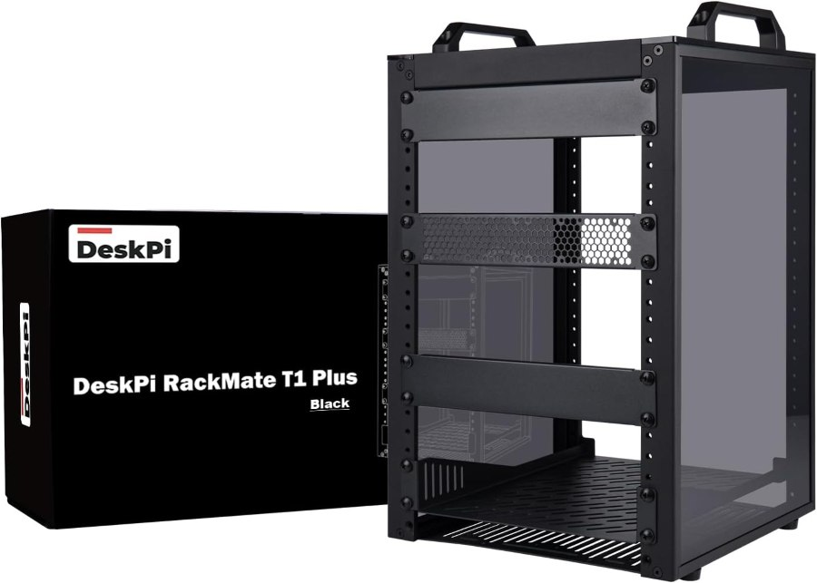
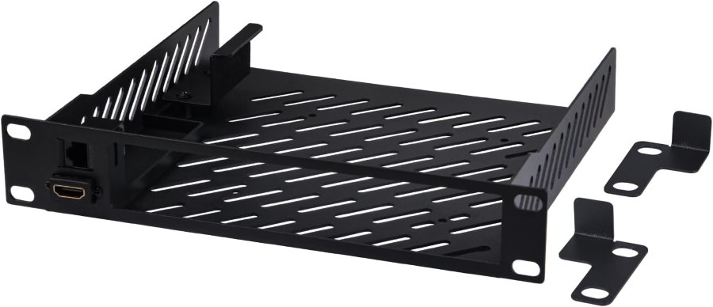
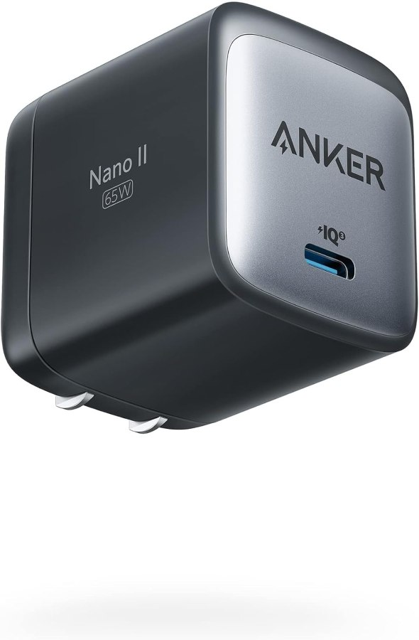
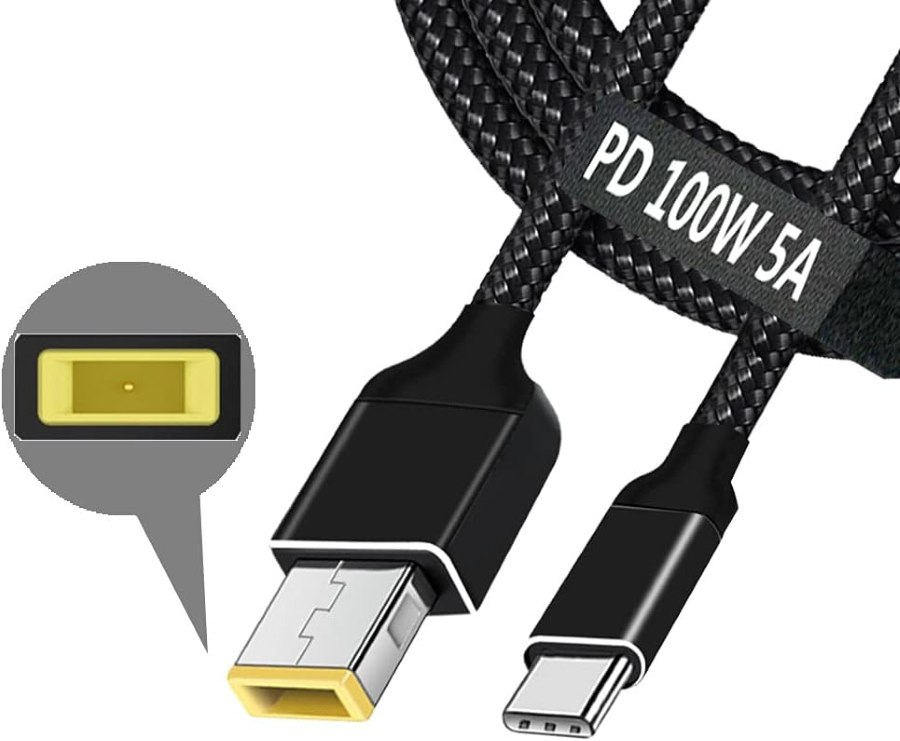
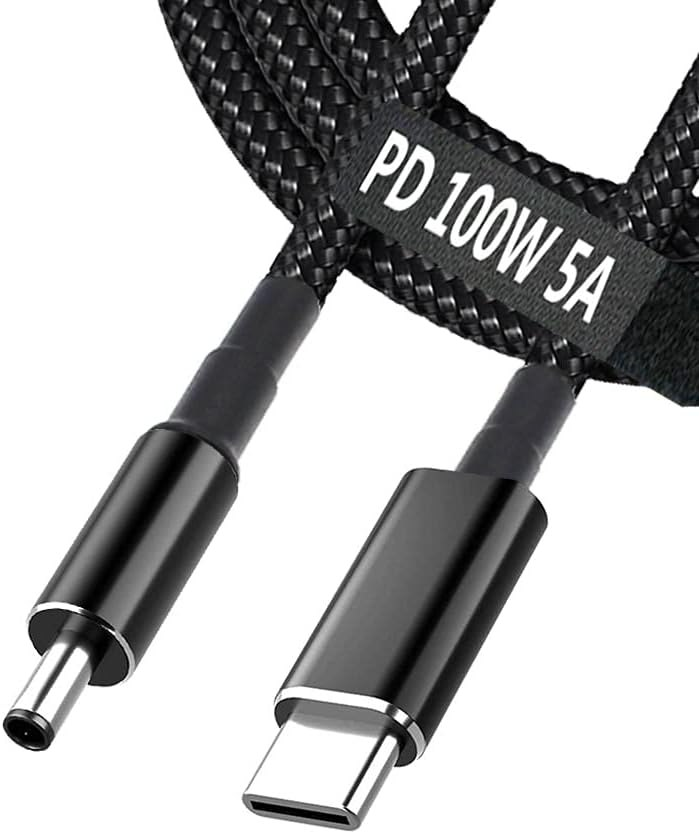
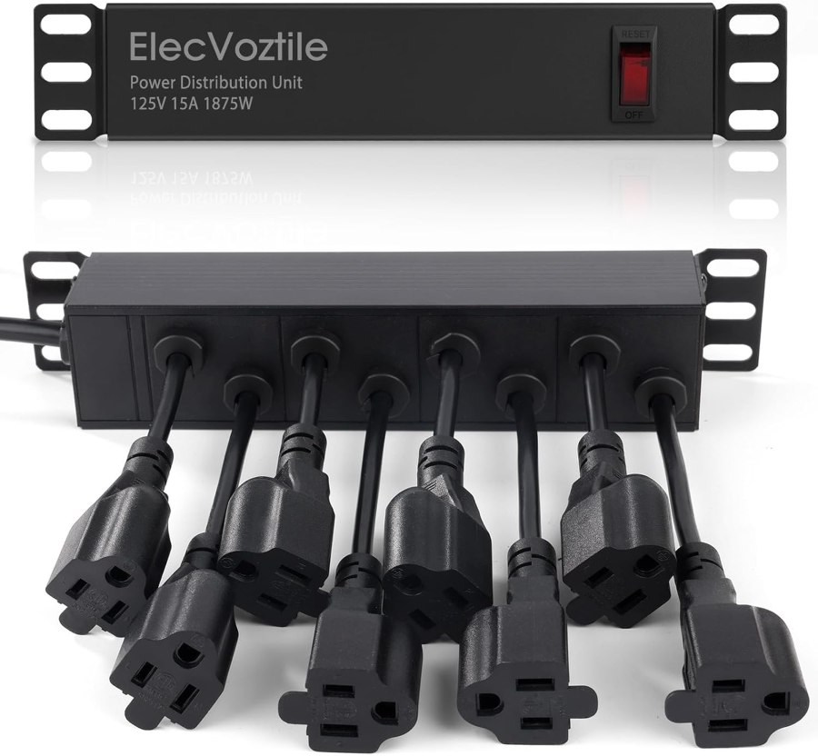
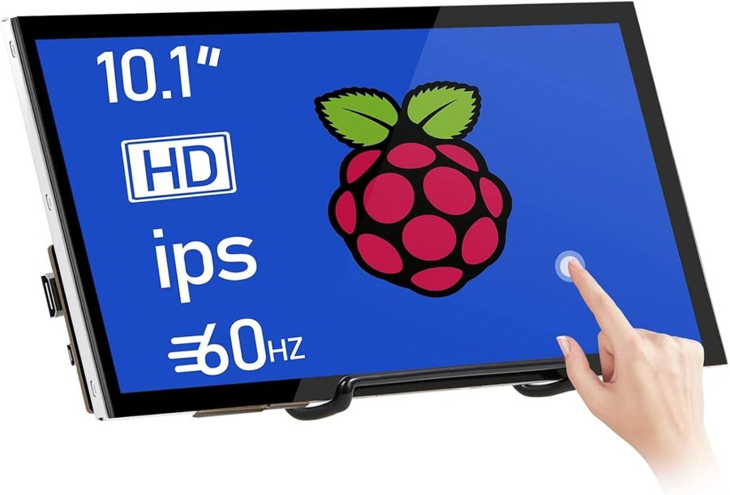

# Gear

The parts that make up the rack, with links. No affiliate tags — these are plain product URLs. Photos are the manufacturers' own listing images, not repo originals.

## Enclosure

<table>
<tr><td width="130"></td>
<td>

**[GeeekPi 8U 10-inch cabinet](https://www.amazon.com/dp/B0FWJXF7FM)** — DeskPi RackMate T1 Plus, qty 1
260 mm depth. This is where the "8U" in the front-elevation diagram comes from.

</td></tr>
<tr><td></td>
<td>

**[GeeekPi 10-inch 1U mini-PC shelf](https://www.amazon.com/dp/B0FN44R7F2)** — qty 6, one per node
Front RJ45 CAT6 + HDMI pass-through per shelf, visible in the photo. This is why every cable in the [build photo](../README.md#rack) reaches from the front of the rack rather than around the back — each shelf brings the node's rear ports forward to its own front face, so patching the switch or checking a display doesn't mean pulling the whole unit out.

</td></tr>
</table>

## Power

<table>
<tr><td width="130"></td>
<td>

**[Anker Nano 65W GaN II PPS](https://www.amazon.com/dp/B08T5QN2TR)** — qty 6
One per node, all the identical model.

</td></tr>
<tr><td></td>
<td>

**[USB-C → Lenovo slim tip, 100W PD](https://www.amazon.com/dp/B0947RD4H2)** — qty 3
ThinkCentre Tiny (`TC1`–`TC3`).

</td></tr>
<tr><td></td>
<td>

**[USB-C → 4.5 × 3.0 mm barrel, 100W PD](https://www.amazon.com/dp/B0975DWM1R)** — qty 3
OptiPlex 7050 Micro (`AI1`–`AI3`).

</td></tr>
<tr><td></td>
<td>

**[ElecVoztile 10-inch 1U PDU](https://www.amazon.com/dp/B0FRMQJGJB)** — qty 1
8 rear outlets, 15A, 1020J surge, 6 ft cable.

</td></tr>
</table>

Neither the ThinkCentre nor the OptiPlex takes USB-C power natively, and the two disagree on plug shape. Rather than sourcing OEM bricks in two different shapes, every node runs the identical Anker charger, and a $10 cable does the plug translation. One spare charger covers any node in the rack; a dead PSU is a generic part, not a discontinued OEM lookup.

> [!NOTE]
> 65W matches each machine's OEM rating rather than exceeding it — there's no headroom for a higher-draw config on either platform. All six nodes at once is roughly 390W, well under the PDU's 1875W ceiling, so the per-node charger rating is the actual constraint, not the rail.

## Console

<table>
<tr><td width="130"></td>
<td>

**[HMTECH 10.1" IPS touchscreen](https://www.amazon.com/dp/B0987468N2)** — qty 1
1024×600, HDMI, driver-free on Windows.

</td></tr>
</table>

Hinged on top of the cabinet, used to check each node's boot and POST output during setup. Not wired as a permanent console for any node.

---

Compute nodes and the switch don't have a purchase link — they came from elsewhere or predate this build. Full inventory including those is in the [hardware table](../README.md#rack) on the main README.
